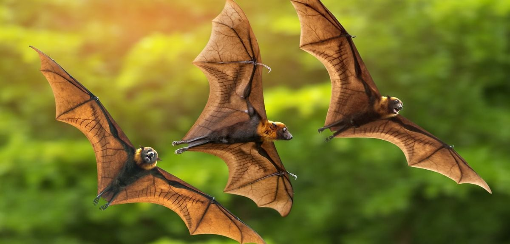

There is a topic that always grabs attention in the autonomous driving industry: whether LiDAR should be adopted? Regarding this question, first, I would like to state my stance: I am in favor of not adopting it. This leads to another question: how would you use LiDAR? I think I'll set this question aside for now, and let's first think about the difference between humans and animals.

Why do bats fly into the glass?

Fig. Bats https://www.ox.ac.uk/news/2020-07-23-genetic-basis-bats-superpowers-revealed.

In nature, there are almost no smooth, low-reflective obstacles like glass, and bats never developed an "avoidance instinct" for them in their evolution. But large glass curtain walls and floor-to-ceiling windows in modern buildings act as numerous "invisible barriers" in bats' flight paths (e.g., low-altitude flight for foraging or migration), directly raising the risk of collisions.
